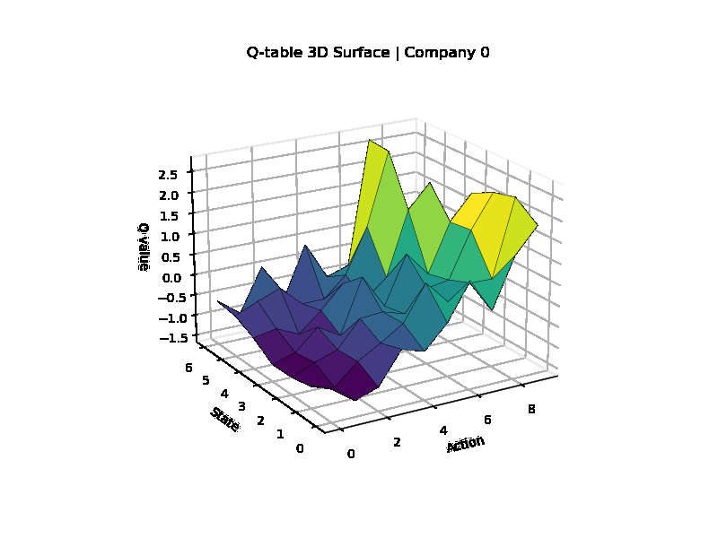

# Innovation Game simulation based on Reinforcement learning

Thanks for your reading!

This is my coding projects for my personal undergraduate paper of economics degree in Xiamen University.

I am a greehand of everything in coding, and hope one day I can figure all things out.

This project is under constructing.

**For newest or last work I have done, please check the v2.0innovation directory directly, and ignore other files**.
## Some naive results




## New MARL Benchmark Path (PettingZoo + RLlib)

This repository now includes a true multi-agent environment and baseline benchmark scripts.

### Added modules

- `market_core.py`: pure transition helpers extracted from the legacy environment logic
- `market_marl_env.py`: PettingZoo `ParallelEnv` implementation (`MarketParallelEnv`)
- `tests/test_market_core.py` and `tests/test_market_marl_env.py`: smoke tests

### Install dependencies

```bash
python -m pip install --upgrade pip
python -m pip install gymnasium pettingzoo ray[rllib] numpy scipy pytest
```

### Train DQN agents

Please run the bash lines in the v2.0innovation by using train bash file first and use test bash file to collect test data, at last, use plot bash to draw the results of tests.

